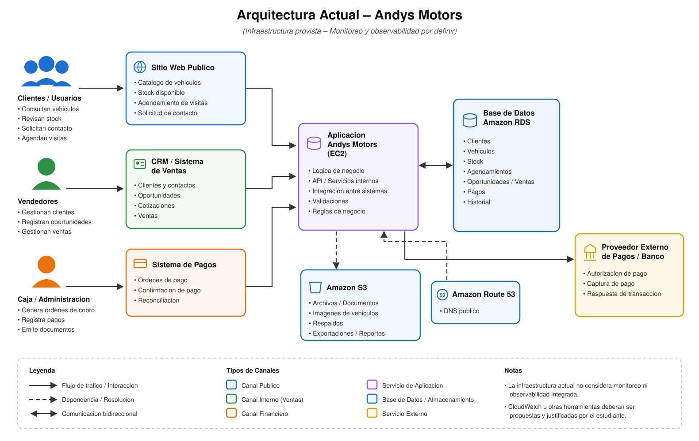

# Caso: Andys Motors

> Empresa ficticia creada con fines académicos para la asignatura **ADY1103 - Monitoreo y
> Observabilidad**. Cualquier parecido con una organización real es coincidencia.

## 1. La empresa

**Andys Motors** es una empresa dedicada a la comercialización presencial de vehículos
nuevos y usados.

La empresa cuenta con distintas sucursales y utiliza diversos sistemas tecnológicos para
soportar su operación. Entre sus principales plataformas se encuentran:

- Sitio web público.
- Sistema de gestión de clientes y ventas (CRM).
- Sistema de consulta de stock de vehículos.
- Sistema de agendamiento de visitas.
- Plataforma de pagos utilizada durante el proceso de venta.
- Base de datos central de clientes, vehículos y operaciones.

El sitio web **no realiza ventas directas de vehículos**. Su principal objetivo es permitir
que potenciales clientes consulten vehículos, revisen disponibilidad, soliciten contacto y
agenden visitas.

La venta propiamente tal es realizada por un ejecutivo comercial mediante el CRM, y finaliza
mediante los sistemas de pago de la empresa.

## 2. Arquitectura tecnológica actual

La plataforma utiliza principalmente servicios desplegados en Amazon Web Services.



### Descripción

Las aplicaciones utilizadas por el sitio web y los sistemas internos se encuentran
desplegadas principalmente sobre instancias **Amazon EC2**, que concentran la lógica de
negocio, las API y servicios internos, la integración entre sistemas, las validaciones y las
reglas de negocio.

La información relacionada con clientes, vehículos, disponibilidad, agendamientos,
oportunidades, ventas, pagos e historial es almacenada en **Amazon RDS**.

Los archivos y documentos, las imágenes de vehículos, los respaldos y las exportaciones o
reportes se almacenan en **Amazon S3**. La resolución del dominio público se realiza mediante
**Amazon Route 53**.

Los sistemas de pago se comunican además con un **proveedor externo de procesamiento de
pagos**, responsable de la autorización, la captura del pago y la respuesta de la
transacción.

Actualmente el equipo de infraestructura utiliza principalmente **Amazon CloudWatch** para
observar métricas de infraestructura asociadas a EC2 y RDS.

### Canales de interacción

| Actor | Sistema que utiliza | Actividades |
|---|---|---|
| Clientes / Usuarios | Sitio web público | Consultan vehículos, revisan stock, solicitan contacto y agendan visitas |
| Vendedores | CRM / Sistema de ventas | Gestionan clientes, registran oportunidades y gestionan ventas |
| Caja / Administración | Sistema de pagos | Genera órdenes de cobro, registra pagos y emite documentos |

## 3. Comportamiento observado del negocio

La plataforma opera técnicamente durante las **24 horas**.

Sin embargo, los datos históricos obtenidos mediante Google Analytics indican que el tráfico
del sitio web cambia considerablemente dependiendo del horario:

| Horario | Comportamiento observado |
|---|---|
| 00:00 - 02:00 | Tráfico bajo |
| 02:00 - 06:00 | Tráfico prácticamente nulo |
| 06:00 - 09:00 | Incremento progresivo |
| 09:00 - 19:00 | Tráfico alto |
| 19:00 - 22:00 | Tráfico medio |
| 22:00 - 00:00 | Tráfico bajo |

Consideraciones adicionales sobre la operación:

- El horario habitual de atención comercial de las sucursales es entre **09:00 y 19:00**
  horas.
- El período entre **02:00 y 06:00** horas es utilizado ocasionalmente por el equipo de
  infraestructura para ejecutar actividades de mantenimiento.
- Los sistemas internos de **CRM, ventas y pagos** presentan su mayor criticidad durante el
  horario comercial.

---

## Infraestructura del caso

La carpeta [`infra/`](./infra) contiene el código **Terraform** que levanta esta misma
arquitectura sobre una cuenta de **AWS Academy Learner Lab**: las instancias EC2, el bucket
S3, los Security Groups y —opcionalmente— la base de datos RDS. Las plataformas del caso
(sitio web, CRM y pagos) corren como contenedores Docker sobre la instancia de aplicación, y
publican métricas a través de tres exporters.

Está escrita específicamente para las restricciones del Learner Lab (no se pueden crear
roles de IAM, las credenciales expiran, las instancias se detienen al cerrar la sesión); el
[README de `infra/`](./infra/README.md) documenta cada una y cómo se trabaja alrededor de
ellas.

---

## Sobre el diagrama

El diagrama está en formato **SVG** ([`assets/arquitectura-andys-motors.svg`](./assets/arquitectura-andys-motors.svg)),
por lo que puede editarse como texto y versionarse con el resto del caso. Se puede abrir
directamente en el navegador, o convertirlo a PNG si se necesita para una presentación:

```bash
# con rsvg-convert (paquete librsvg2-bin)
rsvg-convert -w 1580 assets/arquitectura-andys-motors.svg -o arquitectura.png

# o con un navegador headless, sin instalar nada extra
google-chrome --headless --window-size=1580,1000 \
  --screenshot=arquitectura.png assets/arquitectura-andys-motors.svg
```
